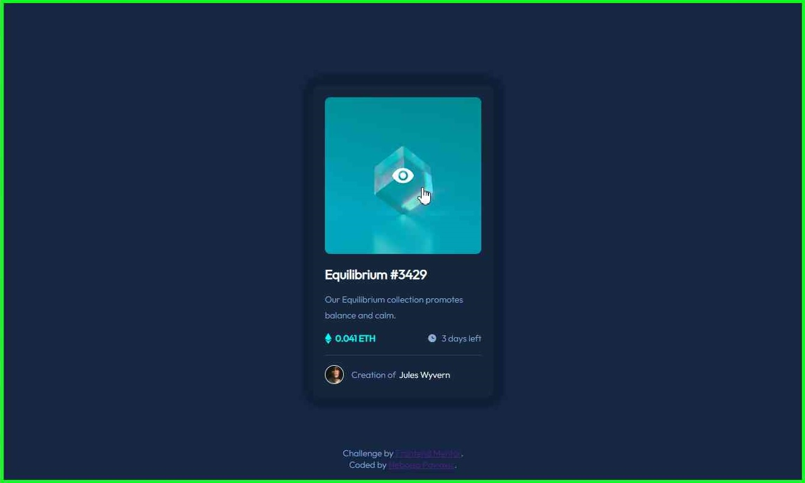
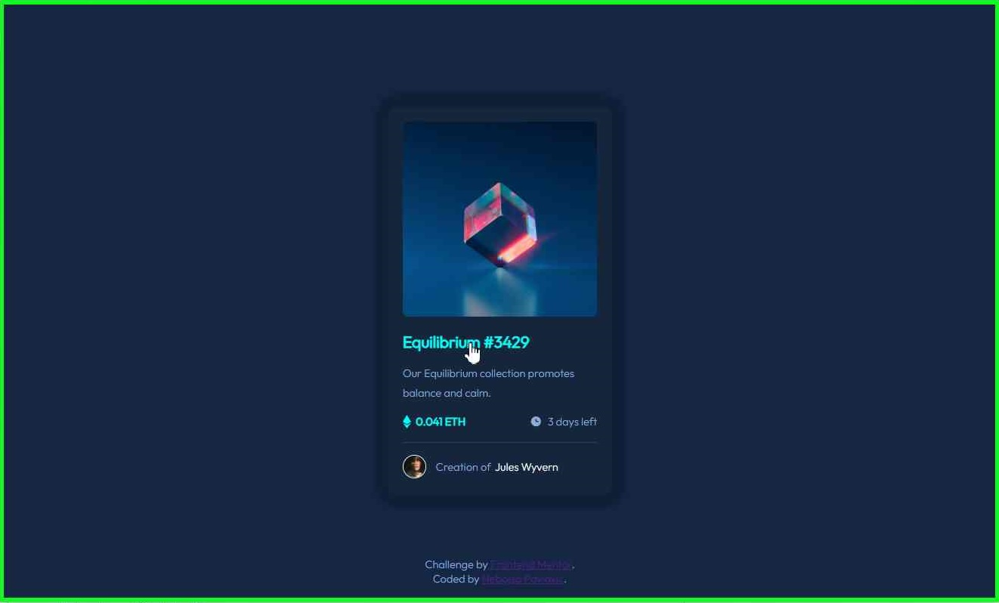
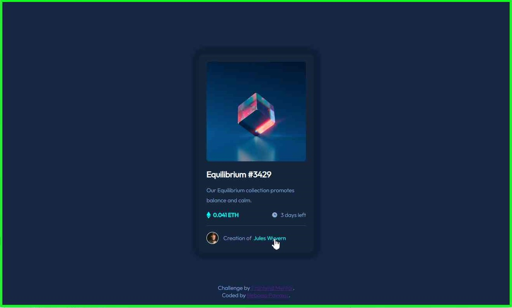
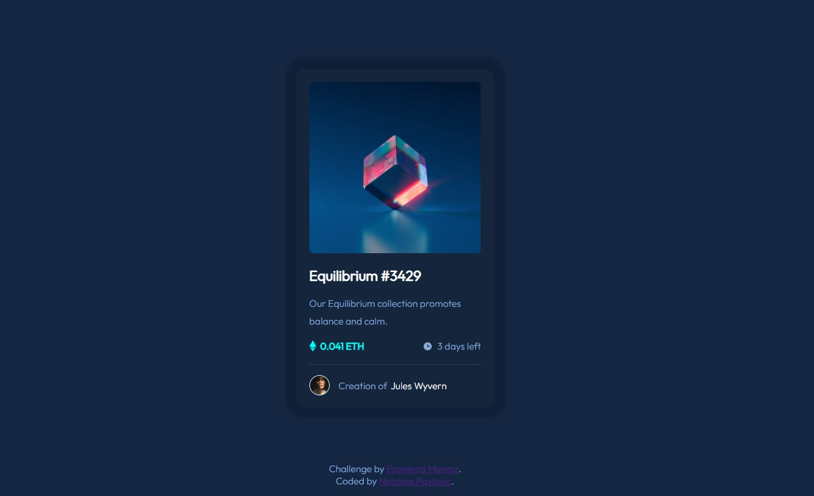
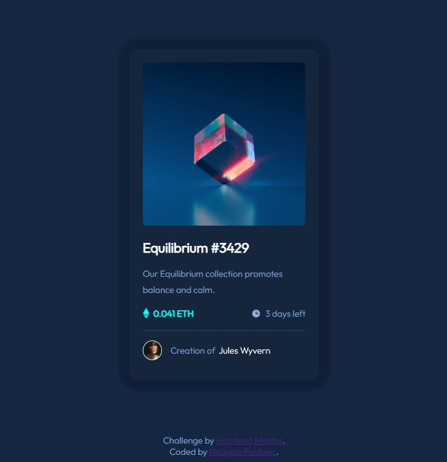

# Frontend Mentor - NFT preview card component solution

This is a solution to the [NFT preview card component challenge on Frontend Mentor](https://www.frontendmentor.io/challenges/nft-preview-card-component-SbdUL_w0U). 

## Table of contents

- [Overview](#overview)
  - [The challenge](#the-challenge)
  - [Screenshots](#screenshots)
  - [Links](#links)
  - [Built with](#built-with)
  - [What I learned](#what-i-learned)
  - [Continued development](#continued-development)
  - [Useful resources](#useful-resources)
- [Author](#author)
- [Acknowledgments](#acknowledgments)

## Overview

### The challenge

Users should be able to:

- View the optimal layout depending on their device's screen size
- See hover states for interactive elements: the "Equilibrium" photo, the article section heading and the name of the author (in the footer).

### Screenshots

### Links

- Solution URL: [Add solution URL here](https://github.com/Nele82/NFT-preview-card.git)
- Live Site URL: [Add live site URL here](https://nelenft.netlify.app)

### Built with

- HTML5 markup
- CSS custom properties
- Flexbox
- CSS Grid
- Mobile-first workflow

### What I learned

I have to say that I am doubly pleased as i've refreshed on many aspects on CSS amongst which "position" in combination with "z-index" properties which i feel that only looks easy at first.

### Continued development

When it comes to design, there are many guidelines to follow in terms of layout & size which I intent to fortify. Currently my primary focus is on Java Script and even though it wasn't a main theme of this project, there were a lot of instances that I could've solved in quarter of the time by using JS.

### Useful resources

- [Vital resource](https://www.youtube.com/watch?v=RGOj5yH7evk)

## Author

- Frontend Mentor - [@Nele82](https://www.frontendmentor.io/profile/Nele82)

**Note: Delete this note and add/remove/edit lines above based on what links you'd like to share.**

## Acknowledgments

Even though this is my very first public project carried out without any kind of direct tutoring, i have to praise a developer from the above mentioned YouTube video [resource](#useful-resources). I  would go as far as saying that it made this project possible seeing how i did not have prior knowledge in using Git in conjunction with GitHub.
